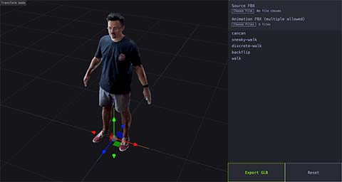

# 3d Animation Merger

This tool allows to merge 3d animations of the same model from multiple FBX files to one GLB file.

## Team
* **Jérémy Minié** — Front-end Developer

## Requirements

### Development

| Name       | Version  |
| ---------- | -------- |
| [Node]     | >= 14.17 |
| [NPM]      | >= 7.0   |

See [`package.json`](blob/master/package.json) in theme for dependencies.

## Usage

```sh
# watch + compile
npm start

# compile + minify
npm run build
```

See [`build.js`](blob/master/build/build.js) and [`watch.js`](blob/master/build/watch.js) for details.


[Node]:         https://nodejs.org/
[NPM]:          https://npmjs.com/
[PHP]:          https://php.net/
[RFC 2119]:     https://datatracker.ietf.org/doc/html/rfc2119
